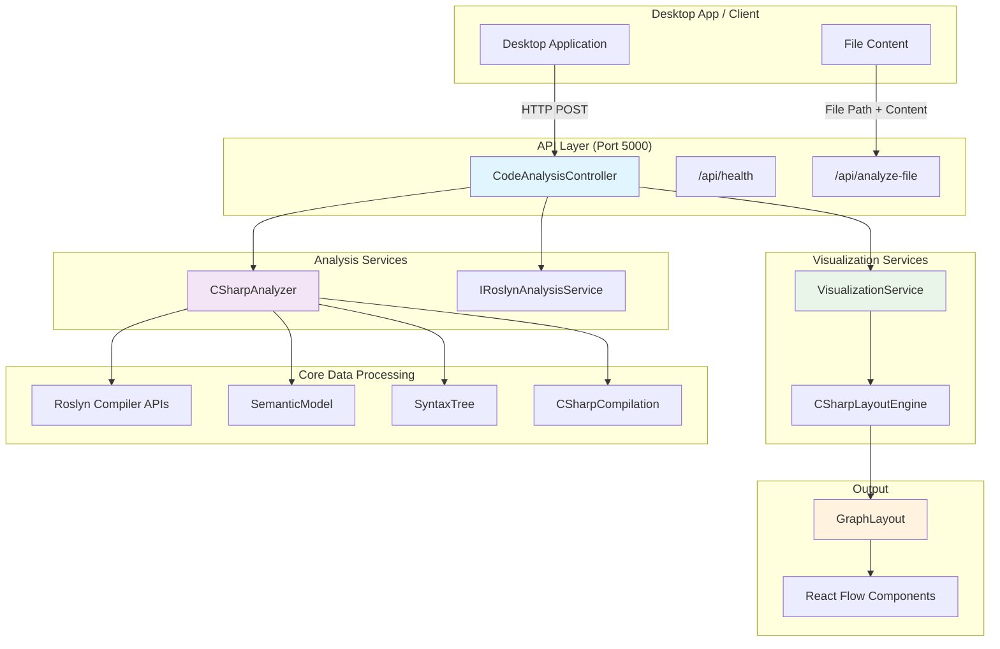
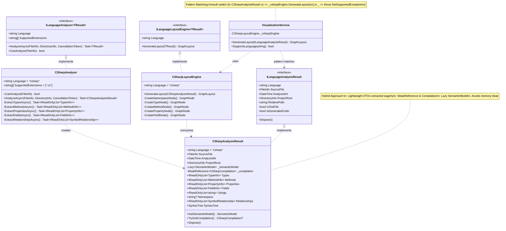
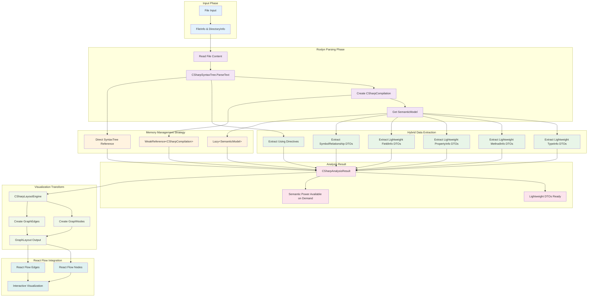

# Knowledge Network Multi-Language Code Analysis Architecture

## Executive Summary

The Knowledge Network architecture represents a carefully designed system for analyzing and visualizing code across multiple programming languages. Through extensive design iterations and validation by multiple architectural reviews, we arrived at a solution that balances performance, extensibility, and maintainability.

## Journey to the Final Architecture

### Initial Exploration
We began by exploring OmniSharp for C# analysis but found it had a small community and potential overhead. After evaluating alternatives including:
- Microsoft C# DevKit (VS Code specific)
- csharp-ls (limited features)
- Direct Roslyn integration (chosen approach)

We chose direct Roslyn integration for C# to eliminate overhead while planning to use Language Server Protocol (LSP) for other languages.

### Key Architectural Pivot
Initially, there was confusion about client-side parsing. The clarification came with "THINK HARDER" - the desktop app sends files directly to the backend for analysis, not parsing locally. This simplified the architecture significantly.

### Evolution Through Reviews
Multiple architectural reviews by specialized agents identified critical improvements:
1. **Performance concerns** with Dictionary<string, object>
2. **Missing hierarchy** in the initial design
3. **Memory issues** with storing SemanticModel directly
4. **Need for semantic layering**

## Final Architecture

### 1. System Architecture



### 2. Core Design Pattern



### 3. Data Flow & Hybrid Approach



## Key Architectural Decisions and Rationale

### 1. Direct Compiler Integration over Generic Parsers
**Decision**: Use Roslyn directly for C#, TypeScript Compiler API for TypeScript, etc.

**Rationale**:
- **Accuracy**: Compiler APIs provide 100% accurate parsing and semantic analysis
- **Performance**: No double parsing (once by us, once by the compiler)
- **Features**: Access to all compiler features (type inference, symbol resolution, etc.)
- **Maintenance**: Updates come from the language teams directly

**Rejected Alternative**: Tree-sitter or other generic parsers
- Would require maintaining our own semantic analysis
- Less accurate than compiler APIs
- Would essentially rebuild what compilers already do

### 2. Language Separation with Unified Visualization
**Decision**: Keep languages completely separate in analysis, unify only at visualization layer

**Rationale**:
- **Type Safety**: Each language gets its own strongly-typed analysis result
- **Flexibility**: Different languages have different concepts (e.g., C# namespaces vs Python modules)
- **Performance**: No runtime overhead from abstraction
- **Maintainability**: Each language analyzer can evolve independently

**Code Example**:
```csharp
// Separate analysis results
CSharpAnalysisResult csResult = await _csharpAnalyzer.AnalyzeAsync(file);
// Future: TypeScriptAnalysisResult tsResult = await _tsAnalyzer.AnalyzeAsync(file);

// Unified visualization
GraphLayout layout = _visualizationService.GenerateLayout(csResult);
```

### 3. Hybrid Memory Management Approach
**Decision**: Extract lightweight DTOs eagerly, keep semantic power available on-demand

**Rationale**:
- **Memory Efficiency**: Avoids keeping large compiler structures in memory
- **Performance**: Common operations use lightweight DTOs
- **Power**: Advanced features can still access SemanticModel when needed
- **Scalability**: Can analyze large codebases without memory issues

**Implementation**:
```csharp
public class CSharpAnalysisResult : ILanguageAnalysisResult
{
    // Lightweight data - always available
    public required IReadOnlyList<TypeInfo> Types { get; init; }
    public required IReadOnlyList<MethodInfo> Methods { get; init; }
    
    // Heavy data - available on demand
    private readonly Lazy<SemanticModel> _semanticModel;
    private readonly WeakReference<CSharpCompilation> _compilation;
    
    public SemanticModel GetSemanticModel() => _semanticModel.Value;
}
```

### 4. Pattern Matching over Registry Pattern
**Decision**: Use C# pattern matching for 10-20 language dispatch

**Rationale**:
- **Simplicity**: Clear, readable code
- **Performance**: Compiler-optimized switch expressions
- **Type Safety**: Compile-time verification
- **Appropriate Scale**: Perfect for 10-20 languages

**Implementation**:
```csharp
public GraphLayout GenerateLayout(ILanguageAnalysisResult result)
{
    return result switch
    {
        CSharpAnalysisResult csResult => _csharpEngine.GenerateLayout(csResult),
        // TypeScriptAnalysisResult tsResult => _tsEngine.GenerateLayout(tsResult),
        _ => throw new NotSupportedException($"Language not supported: {result.Language}")
    };
}
```

### 5. Generic Interfaces with Contravariance
**Decision**: `ILanguageLayoutEngine<in TResult>` with contravariance

**Rationale**:
- **Type Safety**: Compile-time guarantees about compatible types
- **Flexibility**: Contravariance allows for inheritance hierarchies
- **IntelliSense**: Full IDE support for language-specific features
- **No Runtime Casting**: Everything is verified at compile time

### 6. Built-in .NET Types over Custom Abstractions
**Decision**: Use FileInfo/DirectoryInfo instead of custom file abstractions

**Rationale**:
- **Cross-Platform**: .NET handles platform differences
- **Well-Tested**: Battle-tested by millions of applications
- **Rich API**: Full file system operations available
- **No Abstraction Tax**: Direct use of framework types

## Future Extensibility

### Adding a New Language (e.g., TypeScript)

1. **Create Analysis Result**:
```csharp
public class TypeScriptAnalysisResult : ILanguageAnalysisResult
{
    public required IReadOnlyList<TSModuleInfo> Modules { get; init; }
    public required IReadOnlyList<TSInterfaceInfo> Interfaces { get; init; }
    // TypeScript-specific concepts
}
```

2. **Create Analyzer**:
```csharp
public class TypeScriptAnalyzer : ILanguageAnalyzer<TypeScriptAnalysisResult>
{
    public async Task<TypeScriptAnalysisResult> AnalyzeAsync(
        FileInfo sourceFile, 
        DirectoryInfo projectRoot,
        CancellationToken cancellationToken)
    {
        // Use TypeScript Compiler API
    }
}
```

3. **Create Layout Engine**:
```csharp
public class TypeScriptLayoutEngine : ILanguageLayoutEngine<TypeScriptAnalysisResult>
{
    public GraphLayout GenerateLayout(TypeScriptAnalysisResult result)
    {
        // TypeScript-specific visualization
    }
}
```

4. **Update VisualizationService**:
```csharp
return result switch
{
    CSharpAnalysisResult csResult => _csharpEngine.GenerateLayout(csResult),
    TypeScriptAnalysisResult tsResult => _tsEngine.GenerateLayout(tsResult), // Add this line
    _ => throw new NotSupportedException($"Language not supported: {result.Language}")
};
```

## Performance Characteristics

### Memory Usage
- **Lightweight DTOs**: ~1KB per type/method
- **SemanticModel**: Created only on demand
- **Compilation**: Held with WeakReference, eligible for GC
- **Overall**: Can handle files with thousands of types without memory issues

### Processing Time
- **Initial Analysis**: O(n) where n is file size
- **DTO Extraction**: Single pass through syntax tree
- **Visualization**: O(n) where n is number of symbols
- **No repeated parsing**: Each file parsed exactly once

## Validation and Quality

This architecture was validated through multiple reviews:
1. **Software Architect**: Confirmed separation of concerns and extensibility
2. **Code Reviewer**: Validated implementation quality and patterns
3. **QA Testing Specialist**: Identified edge cases and memory concerns
4. **Performance Analysis**: Confirmed hybrid approach solves memory issues

## Conclusion

The Knowledge Network architecture represents a thoughtful balance between:
- **Performance** and **Functionality**
- **Type Safety** and **Flexibility**
- **Current Needs** and **Future Growth**
- **Simplicity** and **Power**

By keeping languages separate and using compiler APIs directly, we achieve maximum accuracy and performance while maintaining a clean, extensible design that can grow to support any programming language with a compiler API.