# CfgToKnowledgeNodeConverter.cs Documentation

## File Overview

**File**: `KnowledgeNetwork.Domains.Code\Converters\CfgToKnowledgeNodeConverter.cs`  
**Namespace**: `KnowledgeNetwork.Domains.Code.Converters`  
**Purpose**: Converts Control Flow Graph domain models to unified KnowledgeNode format  
**Core Responsibility**: Bridge between CFG analysis results and visualization-ready unified format

## Dependencies

- **KnowledgeNetwork.Core.Models.Core**: KnowledgeNode, NodeType, NodeMetrics, RelationshipPair
- **KnowledgeNetwork.Core.Models.Constants**: PrimaryNodeType, RelationshipTypes
- **KnowledgeNetwork.Domains.Code.Models**: CSharpControlFlowGraph, CSharpBasicBlock
- **KnowledgeNetwork.Domains.Code.Models.Enums**: CSharpBasicBlockKind, CSharpEdgeKind
- **KnowledgeNetwork.Domains.Code.Models.ControlFlow**: CSharpOperationInfo

## Complete Class Flow Visualization

```mermaid
graph TB
    %% Public Entry Points
    ConvertCfgToNode[ConvertCfgToKnowledgeNode<br/>Single Method Node<br/>Line 19]
    ConvertCfgToAll[ConvertCfgToAllNodes<br/>All Nodes with Operations<br/>Line 114]
    
    %% Core Conversion Process
    CreateBlockNodes[Create Block Nodes<br/>Lines 24-29 / 119-135]
    ConvertBasicBlock[ConvertBasicBlockToNode<br/>Line 217-280]
    ConvertOperation[ConvertOperationToNode<br/>Line 282-322]
    
    %% Relationship Creation
    CreateEdgeRelations[Add Edge Relationships<br/>Lines 31-46 / 140-153]
    ConvertEdgeToRel[ConvertEdgeToRelationship<br/>Line 324-341]
    ConvertEdgeToReverse[ConvertEdgeToReverseRelationship<br/>Line 343-365]
    GetRelationType[GetRelationshipTypeForEdge<br/>Line 367-377]
    
    %% Method Node Creation
    CreateMethodNode[Create Method Node<br/>Lines 49-103 / 156-210]
    BuildNodeRefs[Build NodeReference List<br/>Lines 60-65 / 167-172]
    BuildProperties[Build Properties Dict<br/>Lines 66-82 / 173-189]
    BuildMetrics[Build NodeMetrics<br/>Lines 83-94 / 190-201]
    BuildVisualization[Build VisualizationHints<br/>Lines 95-100 / 202-207]
    
    %% Helper Methods - Type Classification
    GetMethodCustom[GetMethodCustomType<br/>Line 379-388]
    GetBlockRole[GetBlockRole<br/>Line 390-401]
    GetBlockSecondary[GetBasicBlockSecondaryType<br/>Line 403-412]
    
    %% Helper Methods - Visualization
    GetMethodColor[GetMethodVisualizationColor<br/>Line 414-422]
    GetBlockColor[GetBasicBlockVisualizationColor<br/>Line 424-433]
    GetBlockIcon[GetBasicBlockIcon<br/>Line 435-444]
    GetOpColor[GetOperationVisualizationColor<br/>Line 446-456]
    GetOpIcon[GetOperationIcon<br/>Line 458-469]
    
    %% Flow - ConvertCfgToKnowledgeNode (Method Only)
    ConvertCfgToNode --> CreateBlockNodes
    CreateBlockNodes --> ConvertBasicBlock
    ConvertBasicBlock --> GetBlockSecondary
    ConvertBasicBlock --> GetBlockColor
    ConvertBasicBlock --> GetBlockIcon
    ConvertBasicBlock --> GetBlockRole
    CreateBlockNodes --> CreateEdgeRelations
    CreateEdgeRelations --> ConvertEdgeToRel
    CreateEdgeRelations --> ConvertEdgeToReverse
    ConvertEdgeToRel --> GetRelationType
    ConvertEdgeToReverse --> GetRelationType
    CreateEdgeRelations --> CreateMethodNode
    CreateMethodNode --> BuildNodeRefs
    CreateMethodNode --> BuildProperties
    CreateMethodNode --> BuildMetrics
    CreateMethodNode --> BuildVisualization
    BuildVisualization --> GetMethodColor
    CreateMethodNode --> GetMethodCustom
    BuildNodeRefs --> GetBlockRole
    
    %% Flow - ConvertCfgToAllNodes (With Operations)
    ConvertCfgToAll --> CreateBlockNodes
    CreateBlockNodes --> ConvertBasicBlock
    ConvertBasicBlock --> ConvertOperation
    ConvertOperation --> GetOpColor
    ConvertOperation --> GetOpIcon
    CreateBlockNodes --> CreateEdgeRelations
    CreateEdgeRelations --> CreateMethodNode
    CreateMethodNode --> InsertMethod[Insert Method Node First<br/>Line 212]
    InsertMethod --> ReturnAllNodes[Return List&lt;KnowledgeNode&gt;<br/>Line 214]
    
    %% Output - ConvertCfgToKnowledgeNode
    CreateMethodNode --> ReturnMethodNode[Return KnowledgeNode<br/>Line 105]
    
    %% Styling
    classDef entryClass fill:#e3f2fd,stroke:#1976d2,stroke-width:3px
    classDef conversionClass fill:#f3e5f5,stroke:#7b1fa2,stroke-width:2px
    classDef relationClass fill:#ffebee,stroke:#d32f2f,stroke-width:2px
    classDef buildClass fill:#e8f5e9,stroke:#388e3c,stroke-width:2px
    classDef helperClass fill:#fff3e0,stroke:#f57c00,stroke-width:2px
    classDef visualClass fill:#fce4ec,stroke:#c2185b,stroke-width:2px
    classDef outputClass fill:#e0f2f1,stroke:#00695c,stroke-width:3px
    
    class ConvertCfgToNode,ConvertCfgToAll entryClass
    class CreateBlockNodes,ConvertBasicBlock,ConvertOperation conversionClass
    class CreateEdgeRelations,ConvertEdgeToRel,ConvertEdgeToReverse,GetRelationType relationClass
    class CreateMethodNode,BuildNodeRefs,BuildProperties,BuildMetrics,BuildVisualization buildClass
    class GetMethodCustom,GetBlockRole,GetBlockSecondary helperClass
    class GetMethodColor,GetBlockColor,GetBlockIcon,GetOpColor,GetOpIcon visualClass
    class ReturnMethodNode,ReturnAllNodes,InsertMethod outputClass
```



## Method Descriptions

### Public Methods

#### `ConvertCfgToKnowledgeNode(CSharpControlFlowGraph cfg)` - Lines 19-106
**Purpose**: Converts complete CFG to single KnowledgeNode representing the method  
**Returns**: `KnowledgeNode` - Method node containing references to all basic blocks  
**Key Operations**:
1. Create KnowledgeNode for each basic block (Lines 24-29)
2. Add bidirectional relationships for control flow edges (Lines 32-46)
3. Create method node with contains references to all blocks (Lines 49-103)
4. Build comprehensive metadata and visualization hints

**Node Structure Created**:
- **Method Node**: Primary container with PrimaryNodeType.Method
- **Contains**: References to all basic block nodes
- **Relationships**: None (blocks handle edge relationships)

#### `ConvertCfgToAllNodes(CSharpControlFlowGraph cfg, bool includeOperations = true)` - Lines 114-215
**Purpose**: Converts CFG to complete list of all nodes (method + blocks + operations)  
**Returns**: `List<KnowledgeNode>` - All nodes for detailed visualization  
**Key Operations**:
1. Create basic block nodes (Lines 119-135)
2. Optionally create operation nodes within blocks (Lines 127-134)
3. Add control flow relationships between blocks (Lines 140-153)
4. Create method node and insert at beginning (Lines 156-212)

**Difference from ConvertCfgToKnowledgeNode**:
- Returns **all nodes as separate entities** vs. **single method node with references**
- Supports **operation node inclusion** for detailed visualization
- **Method node is first** in returned list

### Core Conversion Methods

#### `ConvertBasicBlockToNode(CSharpBasicBlock block, string methodId, bool includeOperations = true)` - Lines 217-280
**Purpose**: Converts single basic block to KnowledgeNode  
**Returns**: `KnowledgeNode` with PrimaryNodeType.BasicBlock  
**Data Mapped**:
- **ID**: `block-{methodId}-{block.Id}` format
- **Type**: Primary=BasicBlock, Secondary based on kind (entry/exit/regular)
- **Label**: "Block {ordinal}"
- **Contains**: References to operation nodes (if includeOperations=true)
- **Properties**: Ordinal, kind, reachability, predecessors, successors, branch info
- **Metrics**: Operation count, predecessor/successor counts
- **Visualization**: Color and icon based on block kind

#### `ConvertOperationToNode(CSharpOperationInfo operation, string blockId, int index)` - Lines 282-322
**Purpose**: Converts single operation to KnowledgeNode  
**Returns**: `KnowledgeNode` with Primary="operation"  
**Data Mapped**:
- **ID**: `op-{blockId}-{index}` format
- **Type**: Primary=operation, Secondary=operation kind lowercase
- **Label**: Human-readable operation summary
- **Properties**: Operation kind, syntax, summary, exception potential, index
- **Visualization**: Color and icon based on operation type

### Relationship Conversion Methods

#### `ConvertEdgeToRelationship(CSharpControlFlowEdge edge, string targetNodeId)` - Lines 324-341
**Purpose**: Creates outgoing relationship from edge  
**Returns**: `RelationshipPair` with direction="outgoing"  
**Relationship Types**:
- **Regular**: FlowsTo
- **ConditionalTrue/False**: BranchesTo
- **BackEdge**: LoopsTo

#### `ConvertEdgeToReverseRelationship(CSharpControlFlowEdge edge, string sourceNodeId)` - Lines 343-365
**Purpose**: Creates incoming relationship (reverse of edge)  
**Returns**: `RelationshipPair` with direction="incoming"  
**Implementation**: Swaps forward/reverse relationship type labels

#### `GetRelationshipTypeForEdge(CSharpEdgeKind edgeKind)` - Lines 367-377
**Purpose**: Maps CFG edge kinds to relationship types  
**Mappings**:
- `Regular` → `RelationshipTypes.FlowsTo` (flows-to/flows-from)
- `ConditionalTrue/False` → `RelationshipTypes.BranchesTo` (branches-to/branches-from)
- `BackEdge` → `RelationshipTypes.LoopsTo` (loops-to/loops-from)

### Helper Methods - Type Classification

#### `GetMethodCustomType(CSharpControlFlowGraph cfg)` - Lines 379-388
**Purpose**: Determines custom type based on complexity  
**Classification Logic**:
- **complex-method**: Has loops AND decision points > 2
- **loop-method**: Has loops but simple branching
- **conditional-method**: Has branching but no loops
- **simple-method**: Linear execution flow

#### `GetBlockRole(CSharpBasicBlock? block)` - Lines 390-401
**Purpose**: Determines role string for NodeReference  
**Role Mappings**:
- `CSharpBasicBlockKind.Entry` → "entry"
- `CSharpBasicBlockKind.Exit` → "exit"
- `CSharpBasicBlockKind.Block` → "regular"

#### `GetBasicBlockSecondaryType(CSharpBasicBlockKind kind)` - Lines 403-412
**Purpose**: Determines secondary type for NodeType  
**Type Mappings**:
- `Entry` → "entry-block"
- `Exit` → "exit-block"
- `Block` → "regular-block"

### Helper Methods - Visualization

#### `GetMethodVisualizationColor(int complexity)` - Lines 414-422
**Purpose**: Color coding based on cyclomatic complexity  
**Color Scheme**:
- **≤5**: `#4CAF50` (Green) - Simple methods
- **6-10**: `#FF9800` (Orange) - Moderate complexity
- **>10**: `#F44336` (Red) - High complexity

#### `GetBasicBlockVisualizationColor(CSharpBasicBlockKind kind)` - Lines 424-433
**Purpose**: Color coding for different block types  
**Color Scheme**:
- **Entry**: `#2196F3` (Blue) - Start point
- **Exit**: `#9C27B0` (Purple) - End point
- **Block**: `#607D8B` (Blue Grey) - Regular execution
- **Default**: `#9E9E9E` (Grey) - Unknown

#### `GetBasicBlockIcon(CSharpBasicBlockKind kind)` - Lines 435-444
**Purpose**: Icon selection for block visualization  
**Icon Mappings**:
- **Entry**: "play_arrow" - Start/play symbol
- **Exit**: "stop" - Stop symbol
- **Block**: "crop_square" - Square/block symbol
- **Default**: "help" - Unknown indicator

#### `GetOperationVisualizationColor(string kind)` - Lines 446-456
**Purpose**: Color coding for operation types  
**Color Scheme**:
- **Assignment**: `#8BC34A` (Light Green) - Data flow
- **Invocation**: `#FF5722` (Deep Orange) - Method calls
- **Conditional**: `#E91E63` (Pink) - Decision points
- **Return**: `#673AB7` (Deep Purple) - Exit operations
- **Default**: `#795548` (Brown) - Other operations

#### `GetOperationIcon(string operationKind)` - Lines 458-469
**Purpose**: Icon selection for operation visualization  
**Icon Mappings**:
- **assignment**: "assignment" - Assignment symbol
- **invocation**: "call_made" - Outgoing call
- **conditional**: "help_outline" - Decision symbol
- **return**: "keyboard_return" - Return symbol
- **variable**: "storage" - Storage symbol
- **Default**: "code" - Generic code symbol

## Data Transformation Details

### CFG to KnowledgeNode Mapping

| CFG Domain Model | → | KnowledgeNode Field | Purpose |
|------------------|---|-------------------|---------|
| `CSharpControlFlowGraph.MethodName` | → | `KnowledgeNode.Label` | Human-readable identifier |
| `CSharpControlFlowGraph.TypeName` | → | `Properties["typeName"]` | Containing class information |
| `CSharpControlFlowGraph.BasicBlocks` | → | `Contains` NodeReferences | Hierarchical structure |
| `CSharpControlFlowGraph.Edges` | → | Block `Relationships` | Flow connections |
| `CSharpControlFlowGraph.Metrics` | → | `NodeMetrics` | Quantitative analysis |
| `CSharpBasicBlock.Operations` | → | Operation `KnowledgeNodes` | Detailed execution steps |

### Relationship Bidirectionality

The converter ensures **bidirectional relationships** for proper graph navigation:

```csharp
// Forward relationship: Source → Target
sourceNode.Relationships.Add(new RelationshipPair {
    Type = RelationshipTypes.FlowsTo,
    Direction = "outgoing",
    TargetNodeId = targetNode.Id
});

// Reverse relationship: Target ← Source  
targetNode.Relationships.Add(new RelationshipPair {
    Type = new RelationshipType {
        Forward = "flows-from",    // Swapped
        Reverse = "flows-to",      // Swapped
        Category = "control-flow"
    },
    Direction = "incoming",
    TargetNodeId = sourceNode.Id
});
```

### Visualization Hints Structure

Each converted node receives comprehensive visualization metadata:

```csharp
Visualization = new VisualizationHints
{
    PreferredLayout = "cfg-timeline",      // Layout algorithm
    Collapsed = !includeOperations,       // Initial state
    Color = GetVisualizationColor(type),   // Color coding
    Icon = GetIcon(type),                  // Icon selection
    Position = null,                       // Dynamic positioning
    Size = null                           // Dynamic sizing
}
```

## Integration Points

### Used By

#### **CSharpAnalysisService**
- **Current**: Declared but not yet used (Line 19)
- **Future**: Will replace mock node creation in `AnalyzeControlFlowAsync()`
- **Integration**: `_cfgConverter.ConvertCfgToAllNodes(cfg, includeOperations)`

#### **API Layer**
- **Graph Operations**: Unified format for graph API endpoints
- **Visualization**: Ready-to-render node structure for frontend

### Input Dependencies

#### **CSharpControlFlowGraph** (from CSharpControlFlowAnalyzer)
```csharp
public class CSharpControlFlowGraph 
{
    public string MethodName { get; set; }
    public string TypeName { get; set; }
    public List<CSharpBasicBlock> BasicBlocks { get; } = new();
    public List<CSharpControlFlowEdge> Edges { get; } = new();
    public CSharpComplexityMetrics Metrics { get; set; }
    // ... additional properties
}
```

### Output Format

#### **KnowledgeNode** (Unified Visualization Format)
```csharp
public class KnowledgeNode 
{
    public string Id { get; set; }              // Unique identifier
    public NodeType Type { get; set; }          // Hierarchical typing
    public string Label { get; set; }           // Display name
    public List<NodeReference> Contains { get; set; }  // Child references
    public List<RelationshipPair> Relationships { get; set; }  // Graph edges
    public Dictionary<string, object?> Properties { get; set; }  // Metadata
    public NodeMetrics Metrics { get; set; }    // Quantitative data
    public VisualizationHints Visualization { get; set; }  // Rendering hints
    // ... additional properties
}
```

## Node ID Strategy

The converter uses a hierarchical ID strategy for clear relationships:

```csharp
// Method ID format
var methodId = $"method-{cfg.TypeName}-{cfg.MethodName}";
// Example: "method-OrderService-ProcessOrder"

// Basic Block ID format  
var blockId = $"block-{methodId}-{block.Id}";
// Example: "block-method-OrderService-ProcessOrder-0"

// Operation ID format
var operationId = $"op-{blockId}-{index}";  
// Example: "op-block-method-OrderService-ProcessOrder-0-2"
```

This strategy enables:
- **Unique Identification**: No ID collisions across different methods
- **Hierarchical Relationships**: Parent-child relationships clear from IDs
- **Efficient Lookup**: Easy to find related nodes by ID patterns

## Performance Characteristics

### Memory Efficiency
- **No Roslyn Retention**: Converts to pure domain objects
- **Selective Operations**: Optional operation node creation
- **Reference-Based Structure**: Nodes reference each other by ID, not object references

### Conversion Speed
- **Linear Complexity**: O(n) where n = number of blocks + operations
- **Single Pass**: One iteration through CFG structure
- **Minimal Computation**: Simple mappings and string formatting

### Visualization Optimization
- **Pre-computed Hints**: Colors, icons, layouts determined during conversion
- **Layout Ready**: PreferredLayout set to "cfg-timeline" for immediate rendering
- **Progressive Enhancement**: Collapsed state allows incremental detail revelation

## Current Implementation Status

### ✅ **Fully Implemented**
- **Complete CFG Conversion**: All CFG elements mapped to KnowledgeNode format
- **Bidirectional Relationships**: Proper graph navigation support
- **Comprehensive Visualization**: Color coding, icons, layout hints
- **Two Conversion Modes**: Single method node vs. all nodes separately
- **Operation Support**: Detailed operation-level conversion
- **Robust Type Classification**: Intelligent categorization of methods and blocks

### 🔄 **Integration Status**
- **Ready for Use**: Complete implementation available
- **Pending Integration**: CSharpAnalysisService needs to replace mock with real conversion
- **API Ready**: Output format compatible with graph API endpoints

## Usage Examples

### Convert CFG to Method Node
```csharp
var converter = new CfgToKnowledgeNodeConverter();
var methodNode = converter.ConvertCfgToKnowledgeNode(cfg);

// Result: Single node containing references to all blocks
// methodNode.Contains[0].NodeId = "block-method-OrderService-ProcessOrder-0"
// methodNode.Contains[1].NodeId = "block-method-OrderService-ProcessOrder-1"
```

### Convert CFG to All Nodes
```csharp
var converter = new CfgToKnowledgeNodeConverter();
var allNodes = converter.ConvertCfgToAllNodes(cfg, includeOperations: true);

// Result: List with method node first, then all block and operation nodes
// allNodes[0] = Method node
// allNodes[1] = Basic block 0
// allNodes[2] = Basic block 1
// allNodes[3] = Operation 0-0
// allNodes[4] = Operation 0-1
```

## Future Enhancement Opportunities

### Advanced Relationship Types
- **Data Flow Relationships**: Variable usage and dependencies
- **Exception Flow**: Exception propagation paths
- **Call Relationships**: Method invocation connections

### Enhanced Visualization
- **Dynamic Positioning**: Calculated node positions for optimal layout
- **Size Hints**: Node sizing based on complexity or operation count
- **Animation Hints**: Transition and emphasis information

### Performance Optimizations
- **Lazy Operation Conversion**: Convert operations only when needed
- **Incremental Updates**: Update existing nodes instead of full reconversion
- **Caching Strategy**: Cache visualization hints for repeated conversions

---

**Last Updated**: August 2025  
**File Version**: As of current complete implementation  
**Related Documentation**: See CSharpAnalysisService.md and CSharpControlFlowAnalyzer.md