# CSharpAnalysisService.cs Documentation

## File Overview

**File**: `KnowledgeNetwork.Domains.Code\Services\CSharpAnalysisService.cs`  
**Namespace**: `KnowledgeNetwork.Domains.Code.Services`  
**Purpose**: Main orchestration service for analyzing C# code using Microsoft Roslyn compiler APIs  
**Core Responsibility**: Coordinates Roslyn parsing, semantic analysis, and conversion to Knowledge Network formats

## Dependencies

- **Microsoft.CodeAnalysis**: Core Roslyn compiler APIs
- **Microsoft.CodeAnalysis.CSharp**: C# specific syntax parsing and semantic analysis
- **CSharpControlFlowAnalyzer**: For control flow graph extraction (Line 18)
- **CfgToKnowledgeNodeConverter**: For unified format conversion (Line 19)
- **Domain Models**: CSharpCodeAnalysisResult, CSharpClassInfo, CSharpMethodInfo, etc.
- **Core Models**: KnowledgeNode, NodeType, NodeMetrics, etc.

## Complete Class Flow Visualization

```mermaid
graph TB
    %% Public Entry Points
    AnalyzeAsync[AnalyzeAsync<br/>Basic Analysis<br/>Line 31]
    ExtractControlFlow[ExtractControlFlowAsync<br/>CFG Extraction<br/>Line 103]
    AnalyzeControlFlow[AnalyzeControlFlowAsync<br/>Unified Format<br/>Line 132]
    AnalyzeMethodCFG[AnalyzeMethodControlFlowAsync<br/>Single Method<br/>Line 239]
    IsHealthy[IsHealthyAsync<br/>Health Check<br/>Line 263]
    CreateComp[CreateCompilation<br/>Compilation Factory<br/>Line 85]
    
    %% Core Processing
    ParseText[CSharpSyntaxTree.ParseText<br/>Line 36/108/269]
    CheckDiagnostics[Check Syntax Errors<br/>Line 39-50]
    GetRoot[GetRootAsync<br/>Line 53]
    
    %% Extraction Methods
    ExtractClasses[ExtractClasses<br/>Line 286-298]
    ExtractMethods[ExtractMethods<br/>Line 303-317]
    ExtractProperties[ExtractProperties<br/>Line 322-337]
    ExtractUsing[ExtractUsingStatements<br/>Line 342-349]
    
    %% Dependencies
    CFGAnalyzer[CSharpControlFlowAnalyzer<br/>_controlFlowAnalyzer<br/>Line 18]
    CFGConverter[CfgToKnowledgeNodeConverter<br/>_cfgConverter<br/>Line 19]
    ExtractAllCFG[ExtractAllControlFlowsAsync<br/>Line 114]
    
    %% Mock Data (Temporary)
    CreateMockNodes[Create Mock Nodes<br/>Lines 142-223]
    MockMethod[Create Mock Method Node<br/>Lines 145-183]
    MockBlocks[Create Mock Basic Blocks<br/>Lines 186-218]
    
    %% Helper Methods
    GetNamespace[GetNamespace<br/>Line 354-358]
    GetContainingClass[GetContainingClass<br/>Line 363-367]
    GetBasicReferences[GetBasicReferences<br/>Line 372-381]
    
    %% Results
    BuildAnalysisResult[Build CSharpCodeAnalysisResult<br/>Lines 56-65]
    ReturnError[Return Error Result<br/>Lines 44-49/71-77]
    ReturnCFGs[Return List&lt;CSharpControlFlowGraph&gt;<br/>Line 116]
    ReturnNodes[Return List&lt;KnowledgeNode&gt;<br/>Line 223]
    ReturnMethod[Return KnowledgeNode?<br/>Line 250]
    ReturnHealth[Return bool<br/>Line 273]
    
    %% Flow Connections - AnalyzeAsync
    AnalyzeAsync --> ParseText
    ParseText --> CheckDiagnostics
    CheckDiagnostics -->|Has Errors| ReturnError
    CheckDiagnostics -->|No Errors| GetRoot
    GetRoot --> ExtractClasses
    GetRoot --> ExtractMethods
    GetRoot --> ExtractProperties
    GetRoot --> ExtractUsing
    ExtractClasses --> BuildAnalysisResult
    ExtractMethods --> BuildAnalysisResult
    ExtractProperties --> BuildAnalysisResult
    ExtractUsing --> BuildAnalysisResult
    BuildAnalysisResult --> ReturnNodes
    
    %% Flow Connections - ExtractControlFlowAsync
    ExtractControlFlow --> ParseText
    ParseText --> CreateComp
    CreateComp --> CFGAnalyzer
    CFGAnalyzer --> ExtractAllCFG
    ExtractAllCFG --> ReturnCFGs
    
    %% Flow Connections - AnalyzeControlFlowAsync
    AnalyzeControlFlow --> CreateMockNodes
    CreateMockNodes --> MockMethod
    CreateMockNodes --> MockBlocks
    MockMethod --> ReturnNodes
    MockBlocks --> ReturnNodes
    
    %% Flow Connections - AnalyzeMethodControlFlowAsync
    AnalyzeMethodCFG --> AnalyzeControlFlow
    AnalyzeControlFlow --> FindMethod[Find Method Node<br/>Lines 246-248]
    FindMethod --> ReturnMethod
    
    %% Flow Connections - IsHealthyAsync
    IsHealthy --> ParseText
    ParseText --> CheckHealth[Check Parse Success<br/>Line 270]
    CheckHealth --> ReturnHealth
    
    %% Helper connections
    ExtractClasses --> GetNamespace
    ExtractClasses --> GetContainingClass
    ExtractMethods --> GetContainingClass
    ExtractProperties --> GetContainingClass
    CreateComp --> GetBasicReferences
    
    %% Styling
    classDef entryClass fill:#e3f2fd,stroke:#1976d2,stroke-width:3px
    classDef parseClass fill:#fff3e0,stroke:#f57c00,stroke-width:2px
    classDef extractClass fill:#f3e5f5,stroke:#7b1fa2,stroke-width:2px
    classDef dependClass fill:#ffebee,stroke:#d32f2f,stroke-width:3px
    classDef helperClass fill:#e8f5e9,stroke:#388e3c,stroke-width:2px
    classDef mockClass fill:#fce4ec,stroke:#c2185b,stroke-width:2px,stroke-dasharray: 5 5
    classDef resultClass fill:#e0f2f1,stroke:#00695c,stroke-width:2px
    
    class AnalyzeAsync,ExtractControlFlow,AnalyzeControlFlow,AnalyzeMethodCFG,IsHealthy,CreateComp entryClass
    class ParseText,CheckDiagnostics,GetRoot parseClass
    class ExtractClasses,ExtractMethods,ExtractProperties,ExtractUsing extractClass
    class CFGAnalyzer,CFGConverter,ExtractAllCFG dependClass
    class GetNamespace,GetContainingClass,GetBasicReferences helperClass
    class CreateMockNodes,MockMethod,MockBlocks mockClass
    class BuildAnalysisResult,ReturnError,ReturnCFGs,ReturnNodes,ReturnMethod,ReturnHealth resultClass
```



## Method Descriptions

### Public Methods

#### `AnalyzeAsync(string code)` - Lines 31-78
**Purpose**: Comprehensive C# code analysis with syntax tree parsing and information extraction  
**Returns**: `Task<CSharpCodeAnalysisResult>` - Contains classes, methods, properties, using statements  
**Key Operations**:
1. Parse code to syntax tree (`CSharpSyntaxTree.ParseText`)
2. Check for syntax errors via diagnostics
3. Extract code elements (classes, methods, properties, using statements)
4. Build comprehensive analysis result

**Error Handling**: Returns error result with diagnostic messages on syntax errors or exceptions

#### `ExtractControlFlowAsync(string code)` - Lines 103-124
**Purpose**: Extract control flow graphs for all methods in C# code  
**Returns**: `Task<List<CSharpControlFlowGraph>>` - CFG domain models  
**Key Operations**:
1. Parse code to syntax tree
2. Create compilation context with basic references
3. Delegate to CSharpControlFlowAnalyzer for CFG extraction
4. Return list of control flow graphs

**Error Handling**: Returns empty list on failure, logs error via Debug.WriteLine

#### `AnalyzeControlFlowAsync(string code, bool includeOperations = true)` - Lines 132-230
**Purpose**: Extract control flow and convert to unified KnowledgeNode format  
**Returns**: `Task<List<KnowledgeNode>>` - Unified format for visualization  
**Current Implementation**: **TEMPORARY MOCK** - Creates mock nodes for testing pipeline  
**Mock Data Created**:
- Method node with 3 basic blocks
- Basic block nodes (entry, regular, exit)
- Proper KnowledgeNode structure with visualization hints

**Future Implementation**: Will use real CFG extraction + CfgToKnowledgeNodeConverter

#### `AnalyzeMethodControlFlowAsync(string code, string methodName, bool includeOperations = true)` - Lines 239-257
**Purpose**: Extract single method's control flow as KnowledgeNode  
**Returns**: `Task<KnowledgeNode?>` - Method node or null if not found  
**Implementation**: Calls AnalyzeControlFlowAsync and filters for specific method name

#### `IsHealthyAsync()` - Lines 263-279
**Purpose**: Service health check for operational status  
**Returns**: `Task<bool>` - True if service can parse C# code  
**Test**: Attempts to parse simple "class Test { }" code

#### `CreateCompilation(SyntaxTree syntaxTree)` - Lines 85-96
**Purpose**: Creates Roslyn compilation context for semantic analysis  
**Returns**: `CSharpCompilation` with basic .NET references  
**Configuration**: DynamicallyLinkedLibrary output kind with essential references

### Private Helper Methods

#### Extraction Methods

##### `ExtractClasses(SyntaxNode root)` - Lines 286-298
**Purpose**: Find all class declarations in syntax tree  
**Returns**: `List<CSharpClassInfo>` with class metadata  
**Data Extracted**:
- Class name (identifier)
- Namespace (via GetNamespace helper)
- Modifiers (public, private, etc.)
- Line number location

##### `ExtractMethods(SyntaxNode root)` - Lines 303-317
**Purpose**: Find all method declarations in syntax tree  
**Returns**: `List<CSharpMethodInfo>` with method metadata  
**Data Extracted**:
- Method name and return type
- Modifiers and parameters
- Line number and containing class

##### `ExtractProperties(SyntaxNode root)` - Lines 322-337
**Purpose**: Find all property declarations in syntax tree  
**Returns**: `List<CSharpPropertyInfo>` with property metadata  
**Data Extracted**:
- Property name and type
- Getter/setter detection
- Modifiers and containing class

##### `ExtractUsingStatements(SyntaxNode root)` - Lines 342-349
**Purpose**: Find all using directives in syntax tree  
**Returns**: `List<string>` with namespace names  
**Filters**: Excludes empty or null namespace names

#### Utility Methods

##### `GetNamespace(SyntaxNode node)` - Lines 354-358
**Purpose**: Find namespace containing a syntax node  
**Returns**: String namespace name or empty string  
**Algorithm**: Traverses ancestors to find NamespaceDeclarationSyntax

##### `GetContainingClass(SyntaxNode node)` - Lines 363-367
**Purpose**: Find class containing a syntax node  
**Returns**: String class name or empty string  
**Algorithm**: Traverses ancestors to find ClassDeclarationSyntax

##### `GetBasicReferences()` - Lines 372-381
**Purpose**: Provides essential .NET assembly references for compilation  
**Returns**: `IEnumerable<MetadataReference>` for basic .NET types  
**References Included**:
- `System.Object` (core object model)
- `System.Console` (basic I/O)
- `System.Linq.Enumerable` (LINQ support)

## Integration Points

### Dependencies (Input)

#### **CSharpControlFlowAnalyzer** (Line 18)
```csharp
private readonly CSharpControlFlowAnalyzer _controlFlowAnalyzer = new();
```
- **Used in**: `ExtractControlFlowAsync()` (Line 114)
- **Purpose**: Delegates CFG extraction to specialized analyzer
- **Method Called**: `ExtractAllControlFlowsAsync(compilation, syntaxTree)`

#### **CfgToKnowledgeNodeConverter** (Line 19)
```csharp
private readonly CfgToKnowledgeNodeConverter _cfgConverter = new();
```
- **Current Status**: Declared but not yet used in implementation
- **Future Use**: Convert CFG domain models to KnowledgeNode format
- **Replaces**: Current mock node creation in `AnalyzeControlFlowAsync()`

### Used By (Output)

#### **API Controllers**
- **CodeAnalysisController**: Calls analysis methods for REST endpoints
- **GraphController**: Uses unified KnowledgeNode format for graph operations

#### **Testing Infrastructure**
- **AnalysisTestRunner**: Uses this service for file-based testing
- **Console Application**: Validates analysis capabilities

### Domain Models Produced

#### **CSharpCodeAnalysisResult** (Lines 56-65)
```csharp
public class CSharpCodeAnalysisResult 
{
    public bool Success { get; set; }
    public string LanguageId { get; set; } = "csharp";
    public List<string> Errors { get; set; } = new();
    public SyntaxTree? SyntaxTree { get; set; }
    public List<CSharpClassInfo> Classes { get; set; } = new();
    public List<CSharpMethodInfo> Methods { get; set; } = new();
    public List<CSharpPropertyInfo> Properties { get; set; } = new();
    public List<string> UsingStatements { get; set; } = new();
}
```

#### **KnowledgeNode** (Unified Format)
- **Method Nodes**: Represent methods with CFG structure
- **Basic Block Nodes**: Individual execution units
- **Operation Nodes**: Detailed operation information (when included)

## Error Handling Strategy

### Syntax Error Handling (Lines 39-50)
```csharp
var diagnostics = syntaxTree.GetDiagnostics();
var errors = diagnostics.Where(d => d.Severity == DiagnosticSeverity.Error).ToList();

if (errors.Any())
{
    return new CSharpCodeAnalysisResult
    {
        Success = false,
        Errors = errors.Select(e => e.ToString()).ToList(),
        LanguageId = LanguageId
    };
}
```

### Exception Handling Pattern
- **Graceful Degradation**: All public methods catch exceptions and return safe defaults
- **Error Logging**: Uses Debug.WriteLine for diagnostic information
- **Partial Results**: CFG extraction returns empty list instead of throwing
- **No Exception Propagation**: Callers receive null/empty results instead of exceptions

### Health Check Implementation (Lines 263-279)
```csharp
try 
{
    var testCode = "class Test { }";
    var syntaxTree = CSharpSyntaxTree.ParseText(testCode);
    var diagnostics = syntaxTree.GetDiagnostics();
    return Task.FromResult(true);
} 
catch 
{
    return Task.FromResult(false);
}
```

## Current Implementation Status

### ✅ **Fully Implemented**
- **Basic Code Analysis**: Classes, methods, properties, using statements extraction
- **Syntax Error Detection**: Comprehensive diagnostic checking
- **CFG Extraction**: Integration with CSharpControlFlowAnalyzer
- **Compilation Creation**: Proper Roslyn compilation setup
- **Health Checking**: Service operational status validation

### 🚧 **Temporary Implementation**
- **AnalyzeControlFlowAsync()**: Currently uses mock nodes (Lines 142-223)
- **Mock Data Structure**: Proper KnowledgeNode format for testing visualization pipeline
- **Mock Nodes Created**:
  - 1 Method node with complexity metrics
  - 3 Basic block nodes (entry, regular, exit)
  - Proper relationships and visualization hints

### 🔮 **Future Implementation**
- **Real CFG Conversion**: Replace mock with CfgToKnowledgeNodeConverter usage
- **Operation Node Support**: Include detailed operation information
- **Advanced Analysis**: Semantic analysis integration for richer metadata

## Performance Characteristics

### Design Optimizations
- **Lazy Evaluation**: Only creates compilation when needed for CFG analysis
- **Efficient Parsing**: Single syntax tree parse per analysis operation
- **Minimal References**: Only essential .NET references in compilation
- **Error Short-Circuiting**: Returns immediately on syntax errors

### Memory Management
- **Scoped Compilation**: Compilation objects created per request, not retained
- **Disposal Pattern**: Relies on Roslyn's internal memory management
- **Minimal Object Retention**: Analysis results contain extracted data, not Roslyn objects

### Target Performance
- **Sub-100ms**: Analysis operations for typical code files
- **Batch Capable**: CFG extraction processes multiple methods efficiently
- **Health Check**: <10ms for operational status verification

## Implementation Notes

### Language Identifier
```csharp
public string LanguageId => "csharp";
```
Consistent identifier used across all analysis results for multi-language support.

### Mock Node Strategy (Temporary)
The current mock implementation in `AnalyzeControlFlowAsync()` serves important purposes:
- **Pipeline Testing**: Validates API → Service → Frontend integration
- **Format Validation**: Ensures KnowledgeNode structure works for visualization
- **Development Continuity**: Allows frontend development while CFG conversion is finalized

### Compilation Configuration
```csharp
var compilation = CSharpCompilation.Create(
    assemblyName: "AnalysisAssembly",
    syntaxTrees: new[] { syntaxTree },
    references: GetBasicReferences(),
    options: new CSharpCompilationOptions(OutputKind.DynamicallyLinkedLibrary)
);
```
- **DynamicallyLinkedLibrary**: Allows analysis without executable output
- **Basic References**: Minimal set for typical C# code analysis
- **Single SyntaxTree**: One compilation per analysis request

## Future Enhancement Opportunities

### Semantic Analysis Integration
- **Symbol Resolution**: Access to type information and method signatures
- **Cross-Reference Analysis**: Method call graphs and dependency tracking
- **Advanced Metrics**: Coupling, cohesion, and architectural analysis

### Multi-File Analysis
- **Project-Level Analysis**: Analyze entire projects or solutions
- **Dependency Graphs**: Cross-file relationship tracking
- **Assembly Analysis**: Reference analysis and external dependencies

### Performance Optimizations
- **Compilation Caching**: Reuse compilations for related analysis operations
- **Incremental Analysis**: Update analysis results for code changes
- **Parallel Processing**: Concurrent analysis of multiple files

---

**Last Updated**: August 2025  
**File Version**: As of current implementation with mock nodes  
**Related Documentation**: See CSharpControlFlowAnalyzer.md and CfgToKnowledgeNodeConverter.md