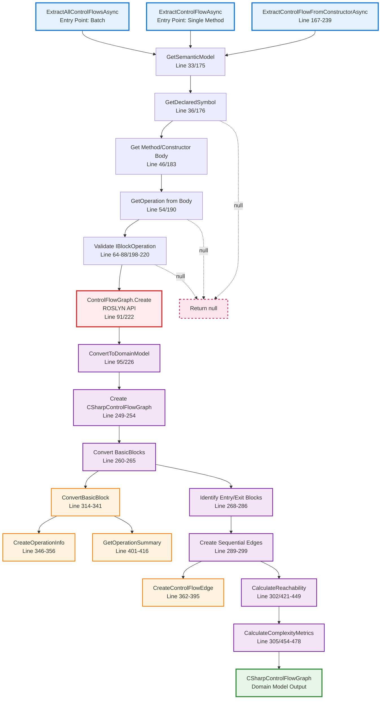

# CSharpControlFlowAnalyzer.cs Documentation

## File Overview

**File**: `KnowledgeNetwork.Domains.Code\Services\CSharpControlFlowAnalyzer.cs`  
**Namespace**: `KnowledgeNetwork.Domains.Code.Services`  
**Purpose**: Extracts control flow graphs from C# code using Microsoft Roslyn  
**Core Responsibility**: Convert Roslyn compiler analysis into Knowledge Network domain models

## Dependencies

- **Microsoft.CodeAnalysis**: Core Roslyn compiler APIs
- **Microsoft.CodeAnalysis.CSharp**: C# specific syntax and semantic analysis
- **Microsoft.CodeAnalysis.FlowAnalysis**: Control flow graph analysis
- **Microsoft.CodeAnalysis.Operations**: Operation tree analysis
- **Domain Models**: CSharpControlFlowGraph, CSharpBasicBlock, etc.

## Complete Class Flow Visualization

## Method Descriptions

### Public Methods

#### `ExtractControlFlowAsync(Compilation, MethodDeclarationSyntax)` - Lines 24-103
**Purpose**: Analyzes single method declaration to extract control flow graph  
**Returns**: `Task<CSharpControlFlowGraph?>` - null on failure  
**Key Steps**:
1. Gets semantic model for symbol resolution
2. Extracts method symbol from declaration
3. Gets IOperation from method body
4. Validates IBlockOperation for CFG creation
5. Calls Roslyn's `ControlFlowGraph.Create()`
6. Converts to domain model

#### `ExtractAllControlFlowsAsync(Compilation, SyntaxTree)` - Lines 111-160
**Purpose**: Batch processes all methods and constructors in syntax tree  
**Returns**: `Task<List<CSharpControlFlowGraph>>` - partial results on errors  
**Key Steps**:
1. Finds all MethodDeclarationSyntax nodes with bodies
2. Finds all ConstructorDeclarationSyntax nodes with bodies
3. Calls ExtractControlFlowAsync for each method
4. Calls ExtractControlFlowFromConstructorAsync for each constructor
5. Aggregates successful results

### Core Private Methods

#### `ExtractControlFlowFromConstructorAsync(Compilation, ConstructorDeclarationSyntax)` - Lines 167-239
**Purpose**: Specialized CFG extraction for constructor declarations  
**Implementation**: Same pipeline as method extraction with constructor-specific handling  
**Special Handling**: Sets method name to `.ctor(parameterTypes)`

#### `ConvertToDomainModel(ControlFlowGraph, SyntaxNode, ISymbol)` - Lines 244-308
**Purpose**: Transforms Roslyn ControlFlowGraph to CSharpControlFlowGraph domain model  
**Key Operations**:
1. Creates CSharpControlFlowGraph with method metadata
2. Converts all BasicBlocks to CSharpBasicBlock objects
3. Identifies entry and exit blocks
4. Creates sequential edges between blocks
5. Calculates reachability and complexity metrics

#### `ConvertBasicBlock(BasicBlock, int)` - Lines 314-341
**Purpose**: Maps individual Roslyn BasicBlock to CSharpBasicBlock  
**Conversions**:
- Operations → CSharpOperationInfo list
- BranchValue → CSharpBranchInfo (if present)
- Ordinal → Block ID and order

#### `CalculateReachability(CSharpControlFlowGraph)` - Lines 421-449
**Purpose**: BFS traversal to mark reachable blocks from entry point  
**Algorithm**: Standard breadth-first search starting from entry block  
**Result**: Sets IsReachable property on all reachable blocks

#### `CalculateComplexityMetrics(CSharpControlFlowGraph)` - Lines 454-478
**Purpose**: Computes complexity metrics for the control flow graph  
**Metrics Calculated**:
- Block count and edge count
- Decision points (conditional branches)
- Loop count (back edges)
- Cyclomatic complexity: E - N + 2
- Exception handling detection

### Helper Methods

#### `CreateOperationInfo(IOperation)` - Lines 346-356
**Purpose**: Converts Roslyn IOperation to CSharpOperationInfo  
**Data Extracted**:
- Operation kind (string representation)
- Syntax text
- Human-readable summary
- Source location
- Exception potential

#### `CreateControlFlowEdge(CSharpBasicBlock, CSharpBasicBlock)` - Lines 362-395
**Purpose**: Creates edges between basic blocks  
**Edge Type Detection**:
- BackEdge: target ID ≤ source ID (loop detection)
- ConditionalTrue: source has branch info
- Regular: sequential flow

#### `GetOperationSummary(IOperation)` - Lines 401-416
**Purpose**: Generates human-readable summaries for operations  
**Supported Operation Types**:
- SimpleAssignment: "x = 5"
- VariableDeclarator: "var x"
- Invocation: "methodName(,,,)"
- Return: "return value"
- Conditional: "? condition"
- BinaryOperator: "left op right"
- Loop: "for/while/foreach loop"

## Key Data Transformations

| Roslyn Type | → | Domain Model | Purpose |
|-------------|---|--------------|---------|
| `ControlFlowGraph` | → | `CSharpControlFlowGraph` | Main CFG structure with metadata |
| `BasicBlock` | → | `CSharpBasicBlock` | Execution units with operations |
| `IOperation` | → | `CSharpOperationInfo` | Individual operation details |
| `BranchValue` | → | `CSharpBranchInfo` | Conditional logic information |
| Sequential blocks | → | `CSharpControlFlowEdge` | Flow relationships |

## Integration Points

### Dependencies (Input)
- **Microsoft.CodeAnalysis.Compilation**: Provides semantic context
- **Microsoft.CodeAnalysis.CSharp.Syntax**: Method and constructor declarations
- **Microsoft.CodeAnalysis.FlowAnalysis**: Roslyn's CFG analysis

### Used By (Output)
- **CSharpAnalysisService.AnalyzeControlFlowAsync()**: Main service integration
- **CfgToKnowledgeNodeConverter.ConvertToKnowledgeNodes()**: Unified format conversion

### Domain Models Created
- **CSharpControlFlowGraph**: Primary output containing complete CFG
- **CSharpBasicBlock**: Individual execution blocks
- **CSharpControlFlowEdge**: Flow connections between blocks
- **CSharpComplexityMetrics**: Quantitative analysis results

## Error Handling Strategy

### Graceful Degradation
- **Individual Method Failure**: Returns `null`, logs error via Debug.WriteLine
- **Batch Processing Failure**: Returns partial results, continues processing
- **No Exceptions Thrown**: Caller receives null/partial results instead of exceptions

### Error Scenarios Handled
- Method without body (abstract, interface methods)
- Failed symbol resolution
- Invalid operation trees
- Missing IBlockOperation
- Roslyn API exceptions

### Logging Approach
- Uses `System.Diagnostics.Debug.WriteLine` for debugging
- Console.WriteLine for high-level progress tracking
- Error details logged but not propagated

## Performance Characteristics

### Design Optimizations
- **Async Operations**: All public methods use async/await
- **Batch Capability**: Process multiple methods in single call
- **Simplified Edges**: O(n) sequential edge creation vs. full graph analysis
- **Early Exit**: Returns null on first failure in single method analysis

### Target Performance
- **Sub-100ms**: Target response time for typical methods
- **Memory Efficient**: Converts to domain models without retaining Roslyn objects
- **Scalable**: Batch processing for entire syntax trees

## Implementation Notes

### Roslyn API Usage
- **Core API**: `ControlFlowGraph.Create(IBlockOperation)` - Roslyn's primary CFG creation
- **Validation**: Ensures IBlockOperation before CFG creation
- **Fallback Handling**: Supports both IBlockOperation and IMethodBodyOperation

### Edge Creation Approach
- **Simplified Model**: Creates sequential edges between consecutive blocks
- **Enhancement Opportunity**: Could be extended to full CFG edge analysis
- **Branch Detection**: Basic conditional branch identification

### Domain Model Philosophy
- **Clean Separation**: Domain models independent of Roslyn types
- **Serialization Ready**: All models designed for JSON serialization
- **Visualization Focused**: Data structured for frontend consumption

## Future Enhancement Opportunities

### Current Limitations
- Simplified edge creation (sequential only)
- Basic exception flow handling
- Limited branch condition analysis

### Potential Improvements
- Full CFG edge analysis with proper branch/merge detection
- Exception propagation path analysis
- Data flow integration
- Cross-method CFG construction
- Advanced loop detection and classification

---

**Last Updated**: August 2025  
**File Version**: As of Sprint 1.2 completion  
**Related Documentation**: See design-documents/SPRINT_1_3_CFG_UNIFIED_IMPLEMENTATION.md