# Classes Analyzers Directory

## Overview
Contains C# class relationship analysis components that leverage Microsoft.CodeAnalysis (Roslyn) to extract and model object-oriented relationships including inheritance, composition, interfaces, and dependencies within C# code files.

## Visual Structure

```mermaid
graph TB
    %% Main Interface
    IAnalyzer[ICSharpClassRelationshipAnalyzer]
    
    %% Concrete Implementation  
    Analyzer[CSharpClassRelationshipAnalyzer]
    
    %% Core Analysis Method
    AnalyzeFile[AnalyzeFileAsync]
    
    %% Roslyn Components
    Compilation[Microsoft.CodeAnalysis.Compilation]
    SemanticModel[SemanticModel]
    CompilationUnit[CompilationUnitSyntax]
    
    %% Analysis Methods
    CreateClassNode[CreateClassNodeAsync]
    AnalyzeInheritance[AnalyzeInheritanceRelationships]
    AnalyzeInterfaces[AnalyzeInterfaceImplementations]
    AnalyzeComposition[AnalyzeCompositionRelationships]
    AnalyzeDependencies[AnalyzeDependencyRelationships]
    AnalyzeNested[AnalyzeNestedClassRelationships]
    
    %% Helper Methods
    SetTypeModifiers[SetClassTypeAndModifiers]
    ExtractBaseClass[ExtractBaseClassAndInterfaces]
    CalcMemberSummary[CalculateMemberSummary]
    CalcComplexity[CalculateComplexityMetricsAsync]
    
    %% Graph Output
    GraphOutput[ClassRelationshipGraph]
    
    %% Dependencies
    Logger[ILogger<CSharpClassRelationshipAnalyzer>]
    Models[KnowledgeNetwork.Domains.Code.Models.Classes]
    
    %% Interface Implementation
    IAnalyzer -.->|implements| Analyzer
    
    %% Main Flow
    Analyzer -->|injects| Logger
    Analyzer -->|main method| AnalyzeFile
    AnalyzeFile -->|uses| Compilation
    AnalyzeFile -->|gets| SemanticModel
    AnalyzeFile -->|processes| CompilationUnit
    
    %% Analysis Pipeline
    AnalyzeFile -->|1| CreateClassNode
    AnalyzeFile -->|2| AnalyzeInheritance
    AnalyzeFile -->|3| AnalyzeInterfaces
    AnalyzeFile -->|4| AnalyzeComposition
    AnalyzeFile -->|5| AnalyzeDependencies
    AnalyzeFile -->|6| AnalyzeNested
    AnalyzeFile -->|outputs| GraphOutput
    
    %% Class Node Creation
    CreateClassNode -->|calls| SetTypeModifiers
    CreateClassNode -->|calls| ExtractBaseClass
    CreateClassNode -->|calls| CalcMemberSummary
    CreateClassNode -->|calls| CalcComplexity
    
    %% Model Dependencies
    Analyzer -->|uses| Models
    GraphOutput -->|contains| Models
    
    %% Styling
    classDef interface fill:#e1f5fe
    classDef concrete fill:#f3e5f5
    classDef method fill:#e8f5e8
    classDef helper fill:#fff3e0
    classDef output fill:#fce4ec
    classDef external fill:#f5f5f5
    
    class IAnalyzer interface
    class Analyzer concrete
    class AnalyzeFile,AnalyzeInheritance,AnalyzeInterfaces,AnalyzeComposition,AnalyzeDependencies,AnalyzeNested method
    class CreateClassNode,SetTypeModifiers,ExtractBaseClass,CalcMemberSummary,CalcComplexity helper
    class GraphOutput output
    class Compilation,SemanticModel,CompilationUnit,Logger,Models external
```

## Components

### ICSharpClassRelationshipAnalyzer
- **Purpose**: Defines the contract for C# class relationship analysis
- **Key Methods**: 
  - `AnalyzeFileAsync`: Analyzes class relationships within a compilation unit (file)
- **Relationships**: Implemented by CSharpClassRelationshipAnalyzer

### CSharpClassRelationshipAnalyzer
- **Purpose**: Concrete implementation that analyzes class-level relationships within C# code
- **Key Methods**: 
  - `AnalyzeFileAsync`: Main entry point that orchestrates the entire analysis pipeline
  - `CreateClassNodeAsync`: Creates structured class node representations from type declarations
  - `AnalyzeInheritanceRelationships`: Detects and models class inheritance hierarchies
  - `AnalyzeInterfaceImplementations`: Maps interface implementations with method-level detail
  - `AnalyzeCompositionRelationships`: Identifies has-a relationships through fields/properties
  - `AnalyzeDependencyRelationships`: Tracks usage dependencies without ownership
  - `AnalyzeNestedClassRelationships`: Models inner/nested class containment
  - `SetClassTypeAndModifiers`: Categorizes class types (class, interface, struct, record) and modifiers
  - `CalculateComplexityMetricsAsync`: Computes WMC, RFC, and other complexity measures
- **Relationships**: Implements ICSharpClassRelationshipAnalyzer, uses ILogger for diagnostics, produces ClassRelationshipGraph

## Key Patterns

**Roslyn-Based Analysis**: Leverages Microsoft.CodeAnalysis for semantic understanding beyond syntax parsing, enabling accurate cross-assembly and generic type analysis.

**Multi-Dimensional Relationship Modeling**: Captures five distinct relationship types (inheritance, interfaces, composition, dependencies, nesting) with rich metadata including multiplicity, visibility, and location information.

**Complexity Metrics Integration**: Implements standard OO metrics like Weighted Methods per Class (WMC) and Response for Class (RFC) alongside member counts and line metrics.

**Error-Resilient Pipeline**: Each analysis phase is isolated with comprehensive logging and exception handling to ensure partial results even when individual components fail.

**Location-Aware Analysis**: All relationships include precise source location information (file, line, column) enabling rich IDE integration and navigation features.

---
*Generated from: src/backend/KnowledgeNetwork.Domains.Code/Analyzers/Classes*