# AnalysisResultFormatter

## Overview
Formats analysis results for console display and Markdown output, providing rich visual representations of C# code analysis and control flow graph data.

## Visual Structure

```mermaid
graph TB
    ARF[AnalysisResultFormatter] --> FACT[FormatAsConsoleTable]
    ARF --> FBACT[FormatBatchResultsAsConsoleTable]
    ARF --> FAM[FormatAsMarkdown]
    ARF --> FBAM[FormatBatchResultsAsMarkdown]
    ARF --> FCFGV[FormatCFGVisualization]
    
    FACT --> FP[File Panel]
    FACT --> ST[Summary Table]
    FACT --> CT[Classes Table]
    FACT --> MT[Methods Table]
    FACT --> CFGT[CFG Table]
    FACT --> ET[Errors List]
    
    FBACT --> BP[Batch Panel]
    FBACT --> RT[Results Table]
    FBACT --> STAT[Statistics Table]
    
    FAM --> MH[Markdown Header]
    FAM --> MST[Markdown Summary Table]
    FAM --> MCT[Markdown Classes Table]
    FAM --> MMT[Markdown Methods Table]
    FAM --> MCFGT[Markdown CFG Table]
    FAM --> MEL[Markdown Errors List]
    
    FBAM --> MBH[Markdown Batch Header]
    FBAM --> MBS[Markdown Batch Summary]
    FBAM --> MBT[Markdown Batch Table]
    
    FCFGV --> CP[CFG Panel]
    FCFGV --> BB[Basic Blocks ASCII]
    FCFGV --> ED[Edges Display]
    FCFGV --> MM[Metrics Display]
    
    %% Data Dependencies
    TR[TestResult] --> FACT
    TR --> FAM
    TR --> FCFGV
    TRL[List TestResult] --> FBACT
    TRL --> FBAM
    CFG[CSharpControlFlowGraph] --> FCFGV
    
    %% Color Coding
    classDef formatter fill:#e1f5fe
    classDef method fill:#f3e5f5
    classDef output fill:#e8f5e8
    classDef data fill:#fff3e0
    
    class ARF formatter
    class FACT,FBACT,FAM,FBAM,FCFGV method
    class FP,ST,CT,MT,CFGT,ET,BP,RT,STAT,MH,MST,MCT,MMT,MCFGT,MEL,MBH,MBS,MBT,CP,BB,ED,MM output
    class TR,TRL,CFG data
```

## Components

### AnalysisResultFormatter
- **Purpose**: Main formatter class for displaying analysis results in multiple formats
- **Key Methods**: 
  - `FormatAsConsoleTable()` - Rich console output for single results
  - `FormatBatchResultsAsConsoleTable()` - Console output for multiple results
  - `FormatAsMarkdown()` - Markdown generation for single results
  - `FormatBatchResultsAsMarkdown()` - Markdown generation for batch results
  - `FormatCFGVisualization()` - ASCII control flow graph display
- **Relationships**: Uses Spectre.Console for rich terminal output, processes TestResult and CSharpControlFlowGraph data

### FormatAsConsoleTable
- **Purpose**: Creates rich console output for single analysis result
- **Key Features**: File panel, summary statistics, classes table, methods table, CFG summary, error display
- **Relationships**: Displays data from TestResult properties and nested AnalysisResult

### FormatBatchResultsAsConsoleTable
- **Purpose**: Displays multiple analysis results in tabular format
- **Key Features**: Batch summary panel, results table with status indicators, aggregate statistics
- **Relationships**: Processes List<TestResult> and calculates aggregate metrics

### FormatAsMarkdown
- **Purpose**: Generates comprehensive Markdown report for single analysis
- **Key Features**: Structured sections with tables for classes, methods, CFG data, and errors
- **Relationships**: Converts TestResult data to formatted Markdown string

### FormatBatchResultsAsMarkdown
- **Purpose**: Creates Markdown summary for multiple analysis results
- **Key Features**: Summary statistics and tabular results overview
- **Relationships**: Aggregates data from multiple TestResult objects

### FormatCFGVisualization
- **Purpose**: ASCII visualization of control flow graphs
- **Key Features**: Block hierarchy display, operation summaries, edge relationships, metrics
- **Relationships**: Processes CSharpControlFlowGraph with basic blocks and edges

## Key Patterns
- **Conditional Formatting**: Color-coded console output based on success/failure status
- **Data Aggregation**: Statistical calculations across multiple test results
- **Progressive Disclosure**: Showing summary first, then detailed breakdowns
- **Truncation Strategy**: Limiting operation display to prevent information overload
- **Multi-Format Output**: Supporting both interactive console and documentation formats

---
*Generated from: KnowledgeNetwork/src/tools/KnowledgeNetwork.AnalysisTester/Formatters/AnalysisResultFormatter.cs*